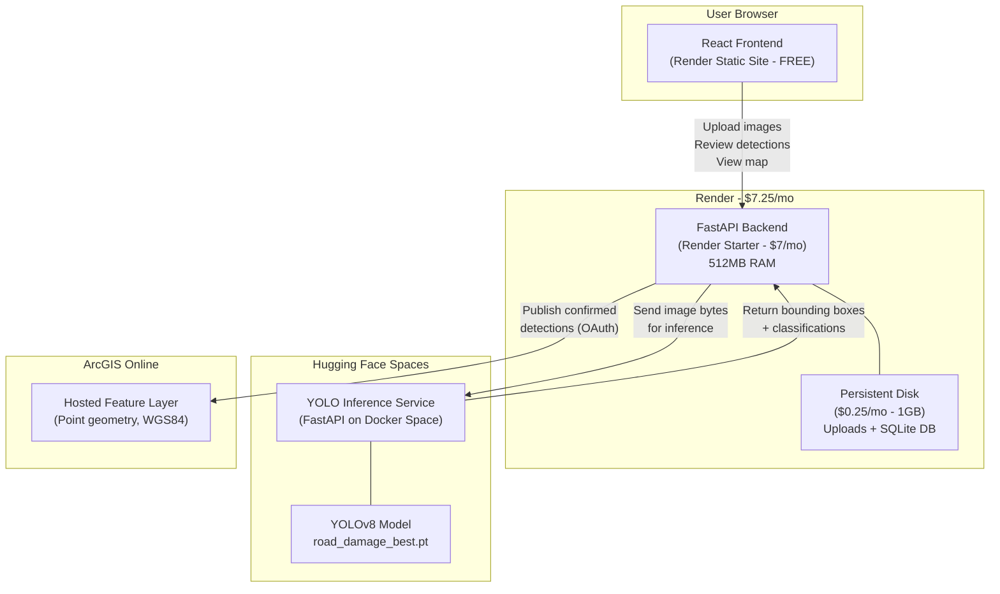
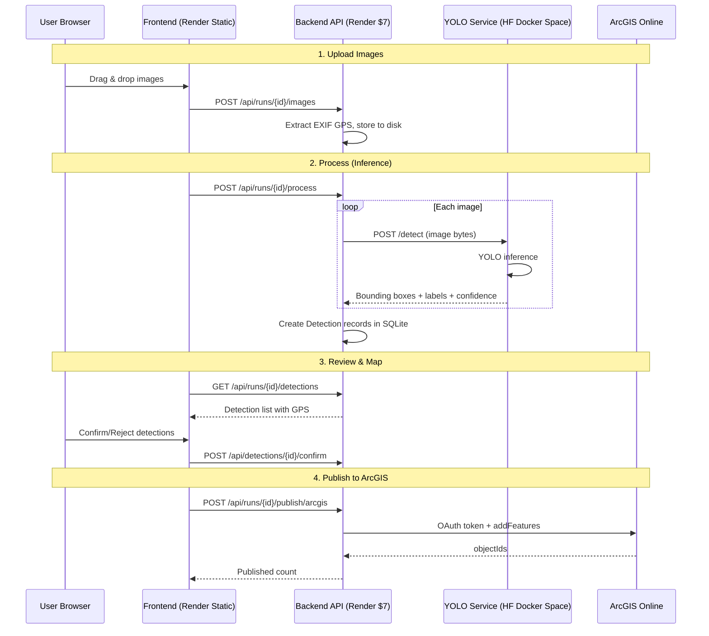
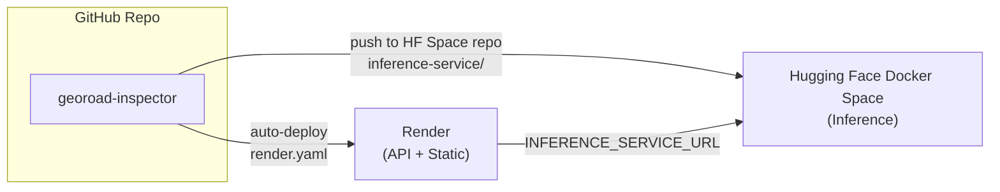

# GeoRoad Inspector

> AI-powered roadway inspection — detects road damage from street-level images, maps detections to GPS coordinates, and publishes structured GIS data to ArcGIS Online.

**Built by [Manoj Boddu](https://www.linkedin.com/in/manumanoj0010/) · [Source Code](https://github.com/manumanoj0010/georoad-inspector)**

---

## System Architecture



## Request Flow



## Deployment Cost Breakdown

| Component | Platform | Cost | RAM | Purpose |
|-----------|----------|------|-----|---------|
| Frontend | Render Static | $0 | CDN | React UI, Leaflet map |
| Backend API | Render Starter | $7/mo | 512MB | REST API, DB, uploads, EXIF, review, GeoJSON, ArcGIS publish |
| Persistent Disk | Render | $0.25/mo | 1GB | Image storage + SQLite |
| YOLO Inference | HF Docker Space | Varies by plan | Varies | Model loading and detection |
| GIS Layer | ArcGIS Online | $0* | — | Hosted feature layer for confirmed detections |

**Total Render cost: ~$7.25/month with full live inference**

## Deployment Topology



## Features

- **Multi-image upload** with drag-and-drop, validation, and EXIF GPS extraction
- **YOLO road damage detection** — fine-tuned model detects potholes, longitudinal cracks, transverse cracks, alligator cracks
- **Interactive Leaflet map** with color-coded markers, popups, and filtering
- **Detection review workflow** — confirm, reject, or flag detections with audit trail
- **GeoJSON export** — standards-compliant FeatureCollection with proper [lon, lat] coordinate order
- **ArcGIS Online publishing** — push confirmed detections to hosted feature layers
- **Dashboard** with summary stats, damage type breakdown, and review progress
- **Demo mode** — preloaded data for immediate demonstration without GPU

## Tech Stack

| Layer | Technology |
|-------|-----------|
| Frontend | React 18, TypeScript, Vite, TailwindCSS, Leaflet |
| Backend | Python, FastAPI, SQLAlchemy (async), Pydantic |
| Database | SQLite (dev) / PostgreSQL (prod) |
| ML Model | YOLOv8 (ultralytics), fine-tuned on RDD2022 |
| GIS | GeoJSON, ArcGIS REST API, Leaflet.js |
| Deployment | Docker, Docker Compose, nginx |

## Quick Start (Local Development)

### Prerequisites
- Python 3.11+
- Node.js 18+

### Backend

```bash
cd backend
python -m venv venv
source venv/bin/activate  # Windows: venv\Scripts\activate
pip install fastapi uvicorn sqlalchemy alembic pydantic pydantic-settings \
    python-multipart pillow exifread ultralytics geojson aiosqlite httpx greenlet

# Copy environment config
cp ../.env.example .env

# Seed demo data (optional — creates a pre-processed inspection run)
python -m app.seed_demo

# Start the API server
uvicorn app.main:app --reload --port 8000
```

### Frontend

```bash
cd frontend
npm install
npm run dev
```

Open http://localhost:5173 — the frontend proxies API requests to the backend.

### Docker Compose

```bash
docker compose up --build
```

Open http://localhost:3000

## Environment Variables

| Variable | Default | Description |
|----------|---------|-------------|
| `DATABASE_URL` | `sqlite+aiosqlite:///./georoad.db` | Database connection string |
| `UPLOAD_DIR` | `./uploads` | Image storage directory |
| `MODEL_WEIGHTS_PATH` | `./models/road_damage_best.pt` | YOLO model weights |
| `DEFAULT_CONFIDENCE_THRESHOLD` | `0.25` | Minimum detection confidence |
| `CORS_ORIGINS` | `http://localhost:5173` | Allowed CORS origins |
| `ARCGIS_PORTAL_URL` | _(empty)_ | ArcGIS Online portal URL |
| `ARCGIS_CLIENT_ID` | _(empty)_ | ArcGIS OAuth client ID |
| `ARCGIS_CLIENT_SECRET` | _(empty)_ | ArcGIS OAuth client secret |
| `ARCGIS_FEATURE_LAYER_URL` | _(empty)_ | Target feature layer endpoint |

## API Documentation

Start the backend and visit http://localhost:8000/docs for interactive Swagger UI.

### Key Endpoints

| Method | Endpoint | Purpose |
|--------|----------|---------|
| `POST` | `/api/inspection-runs` | Create inspection |
| `POST` | `/api/inspection-runs/{id}/images` | Upload images |
| `POST` | `/api/inspection-runs/{id}/process` | Run YOLO detection |
| `GET` | `/api/inspection-runs/{id}/detections` | List detections (filterable) |
| `POST` | `/api/detections/{id}/confirm` | Confirm a detection |
| `POST` | `/api/detections/{id}/reject` | Reject a detection |
| `GET` | `/api/inspection-runs/{id}/geojson` | Get GeoJSON |
| `GET` | `/api/inspection-runs/{id}/geojson/download` | Download .geojson file |
| `POST` | `/api/inspection-runs/{id}/publish/arcgis` | Publish to ArcGIS |

### Detection Filters

`GET /api/inspection-runs/{id}/detections?damage_type=pothole&min_confidence=0.5&review_status=confirmed`

## GeoJSON Format

Output follows the GeoJSON specification (RFC 7946):

```json
{
  "type": "FeatureCollection",
  "features": [
    {
      "type": "Feature",
      "id": "RD-2026-000001",
      "geometry": {
        "type": "Point",
        "coordinates": [-96.8961, 33.0198]
      },
      "properties": {
        "detectionId": "RD-2026-000001",
        "damageType": "pothole",
        "confidence": 0.91,
        "reviewStatus": "confirmed",
        "locationMethod": "camera_exif_approximation",
        "modelVersion": "road_damage_best"
      }
    }
  ]
}
```

## ArcGIS Configuration

1. Create a free [ArcGIS Developer account](https://developers.arcgis.com/sign-up/)
2. Register an OAuth application to get client_id and client_secret
3. Create a hosted feature layer with matching schema
4. Set environment variables:

```bash
ARCGIS_PORTAL_URL=https://www.arcgis.com
ARCGIS_CLIENT_ID=your_client_id
ARCGIS_CLIENT_SECRET=your_client_secret
ARCGIS_FEATURE_LAYER_URL=https://services.arcgis.com/.../FeatureServer/0
```

Without these variables, the app runs in **mock mode** — publishing succeeds locally without contacting ArcGIS.

## Database Schema

Six normalized tables: `inspection_runs`, `images`, `detections`, `review_actions`, `model_versions`, `arcgis_publications`.

## Model

Fine-tuned YOLOv8-nano on the RDD2022 dataset (Road Damage Detection Challenge 2022). Detects:

| Class | Label |
|-------|-------|
| 0 | Longitudinal Crack |
| 1 | Transverse Crack |
| 2 | Alligator Crack |
| 3 | Pothole |

## Testing

```bash
cd backend
python -m pytest tests/ -v
```

22 integration tests covering: image upload, EXIF extraction, YOLO inference, detection storage, review workflow, GeoJSON generation, coordinate order validation, ArcGIS publishing, and duplicate prevention.

## Known Limitations

- GPS coordinates represent the **camera location**, not the exact position of each detected defect
- Single images do not provide depth — no volume or dimension estimation
- Model accuracy depends on image quality, lighting, and road surface type
- The pretrained model covers 4 damage classes; additional classes require retraining
- ArcGIS publishing requires a properly configured hosted feature layer

## Project Structure

```
georoad-inspector/
├── docker-compose.yml
├── .env.example
├── backend/
│   ├── Dockerfile
│   ├── app/
│   │   ├── main.py                 # FastAPI entry point
│   │   ├── config.py               # Environment settings
│   │   ├── database.py             # SQLAlchemy async engine
│   │   ├── seed_demo.py            # Demo data seeder
│   │   ├── models/                 # ORM models (6 tables)
│   │   ├── schemas/                # Pydantic request/response types
│   │   ├── routers/                # API route handlers
│   │   ├── services/               # Business logic
│   │   │   ├── inference.py        # YOLO model management
│   │   │   ├── exif.py             # GPS/EXIF extraction
│   │   │   ├── processing.py       # Detection pipeline
│   │   │   ├── geojson.py          # GeoJSON generation
│   │   │   └── arcgis.py           # ArcGIS publishing
│   │   └── utils/                  # Validation, ID generation
│   ├── models/                     # YOLO weight files
│   └── tests/                      # Integration tests (22 tests)
└── frontend/
    ├── Dockerfile
    ├── src/
    │   ├── App.tsx                  # Main application
    │   ├── api/client.ts            # Typed API client
    │   ├── hooks/useInspection.ts   # State management
    │   ├── types/index.ts           # TypeScript interfaces
    │   └── components/
    │       ├── Dashboard.tsx        # Summary stats
    │       ├── ImageUpload.tsx      # Drag-and-drop upload
    │       ├── DetectionCard.tsx    # Bounding box + review
    │       ├── InspectionMap.tsx    # Leaflet map
    │       ├── FilterPanel.tsx      # Damage/confidence/status filters
    │       ├── ExportPanel.tsx      # GeoJSON download
    │       └── ArcGISPanel.tsx      # ArcGIS publish button
    └── nginx.conf                   # Production proxy config
```
