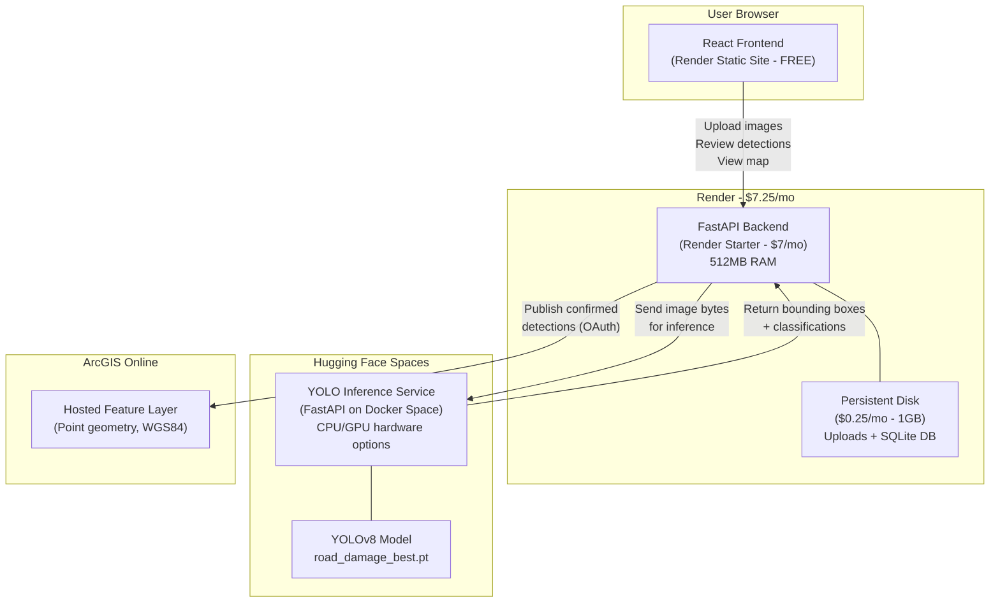
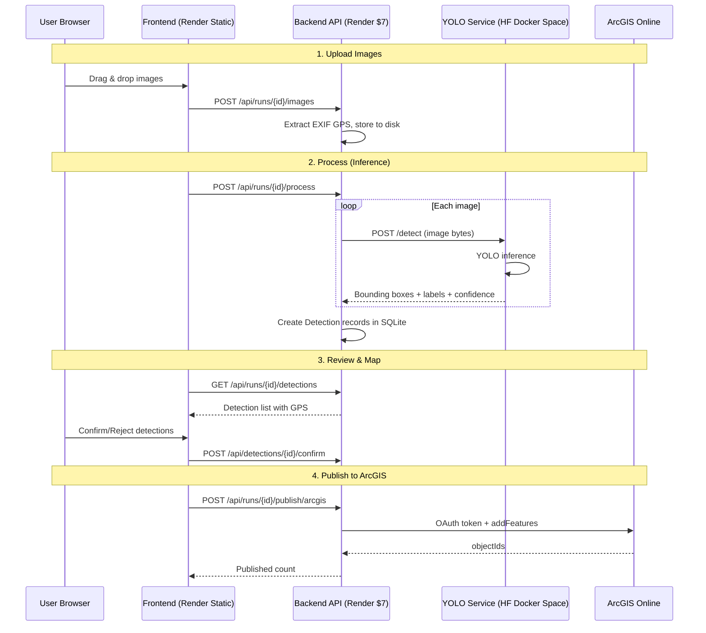
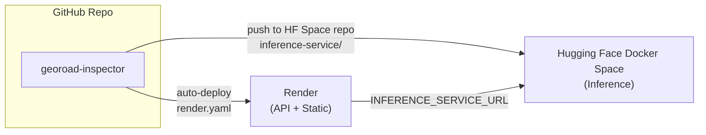

# GeoRoad Inspector — Architecture

## Overview

GeoRoad Inspector uses a split architecture to keep hosting costs predictable while providing full AI-powered road damage detection with live inference.

The memory-intensive YOLO inference runs on a Hugging Face Docker Space, while the lightweight API, database, and review workflow run on Render.

## System Architecture



## Request Flow



## Component Details

| Component | Platform | Cost | RAM | Purpose |
|-----------|----------|------|-----|---------|
| Frontend | Render Static | $0 | CDN | React UI, Leaflet map |
| Backend API | Render Starter | $7/mo | 512MB | REST API, DB, uploads, EXIF, review, GeoJSON, ArcGIS publish |
| Persistent Disk | Render | $0.25/mo | 1GB | Image storage + SQLite |
| YOLO Inference | HF Docker Space | Depends on HF plan/hardware | Varies | Model loading and detection |
| GIS Layer | ArcGIS Online | $0* | — | Hosted feature layer for confirmed detections |

**Render cost remains ~$7.25/month. Add Hugging Face plan/hardware costs as selected.**

## Inference Modes

The backend supports two inference modes controlled by the `INFERENCE_SERVICE_URL` environment variable:

### Remote Mode (Production / Render)
When `INFERENCE_SERVICE_URL` is set, the backend sends images to the Hugging Face Docker Space inference service via HTTP. This keeps the Render instance lightweight (no PyTorch/YOLO in memory).

```
INFERENCE_SERVICE_URL=https://<your-space-subdomain>.hf.space
```

### Local Mode (Development)
When `INFERENCE_SERVICE_URL` is not set, the backend loads the YOLO model directly. This requires sufficient RAM and is intended for local development only.

## Deployment Topology



## Environment Variables

### Render Backend (georoad-inspector-api)
| Variable | Value | Description |
|----------|-------|-------------|
| `DATABASE_URL` | `sqlite+aiosqlite:///./georoad.db` | Database connection |
| `UPLOAD_DIR` | `/opt/render/project/data/uploads` | Persistent image storage |
| `INFERENCE_SERVICE_URL` | `https://<space>.hf.space` | Hugging Face inference endpoint |
| `APP_ENV` | `production` | Environment mode |
| `CORS_ORIGINS` | `https://georoad-inspector-ui.onrender.com` | Allowed CORS origins |
| `ARCGIS_PORTAL_URL` | `https://www.arcgis.com` | ArcGIS portal |
| `ARCGIS_CLIENT_ID` | *(set in Render)* | OAuth client ID |
| `ARCGIS_CLIENT_SECRET` | *(set in Render)* | OAuth client secret |
| `ARCGIS_FEATURE_LAYER_URL` | *(set in Render)* | Target feature layer |

### Hugging Face Docker Space (inference-service)
No service secrets are required by default. The model weights are bundled in the image.

## Hugging Face Deployment

### Prerequisites
- Hugging Face account
- Docker Spaces access on your plan

### Deploy Steps

```bash
# Copy model weights into inference-service before publishing
mkdir -p inference-service/models
cp backend/models/road_damage_best.pt inference-service/models/

# Push inference-service files to your Hugging Face Docker Space repository
# Then wait for Space build to finish and get URL:
# https://<space-subdomain>.hf.space

# Set this URL as INFERENCE_SERVICE_URL in Render backend
```
